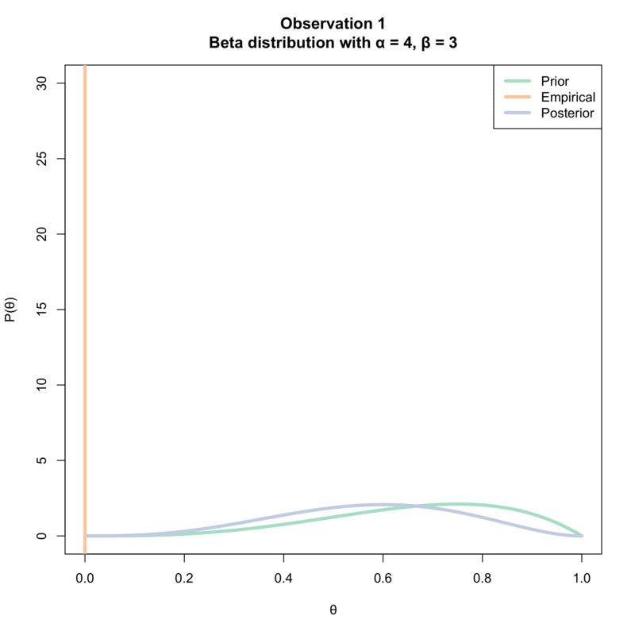

# Visualizing Bayesian Updating with the Beta-Binomial

**Author**: David Shaub

**Affiliation**: ALM Software Engineering Candidate, Harvard Extension School
##

[link to code file](davidshaub_code.R)

### Explanation

This visualization helps to build a more intuitive understanding of how Bayesian updating with the Beta-Binomial model works through visualizing a numeric simulation.

The population has a parameter θ = 0.40, and with 50 observations we see convergence of both the empirical and Bayesian estimates to closer to this value. We use an initial Beta distribution as a prior with parameters α = 4 and β = 2 that actually optimistically has a higher probability around θ = 0.75 as the most maximum likelihood estimate. Nonetheless, we see that the prior helps reduce the volatility of the updated posterior compared to the highly volatile empirical estimate. As we collect additional observations, the uncertainty and variance in the posterior distribution continues to shrink, and a MLE estimate of the posterior converges to the correct θ = 0.40 despite the optimistic prior. This visualization demonstrates key concepts in Bayesian inference:

1. Uncertainty decreases as we make additional observations.
2. The posterior distribution is a combination of the prior (or the previous posterior when make iterated updates) and the empirical likelihood of the observed data.
3. Even when our prior is "incorrect", the Bayesian framework can still prove useful since we'll eventually converge to the correct population statistic with enough data, and when we only have a few observations the prior can reduce the volatility compared to a purely empirical estimate.
4. When we have very little data, both the empirical and the Bayesian updates shift more drastically compared to when we have collected more observations. This shows that the Bayesian framework provides the most benefit at reducing volatility at the beginning when the is large uncertainty in the likelihood estimates.
5. When the empirical estimate is lower than both the prior and the posterior, it will tug the next updated posterior lower, but our initial prior will have a mediating effect and prevent it from shifting dramatically lower. On the contrary, when the empirical estimate for a trial is above posterior, it will tug the updated posterior higher. In this particular setup where our prior was actually too high, the latter move will tend to be larger than the former since the model would eagerly converge to values that (if the empirical data matches as well).

### Running

This project has two dependencies

* [R](https://www.r-project.org/): no packages are required, however
* [imagemagick](https://www.imagemagick.org/script/download.php): combining png files into a gif

The gif can be created by running `./davidshaub_code.sh`, and this should take around 45 seconds to complete.
